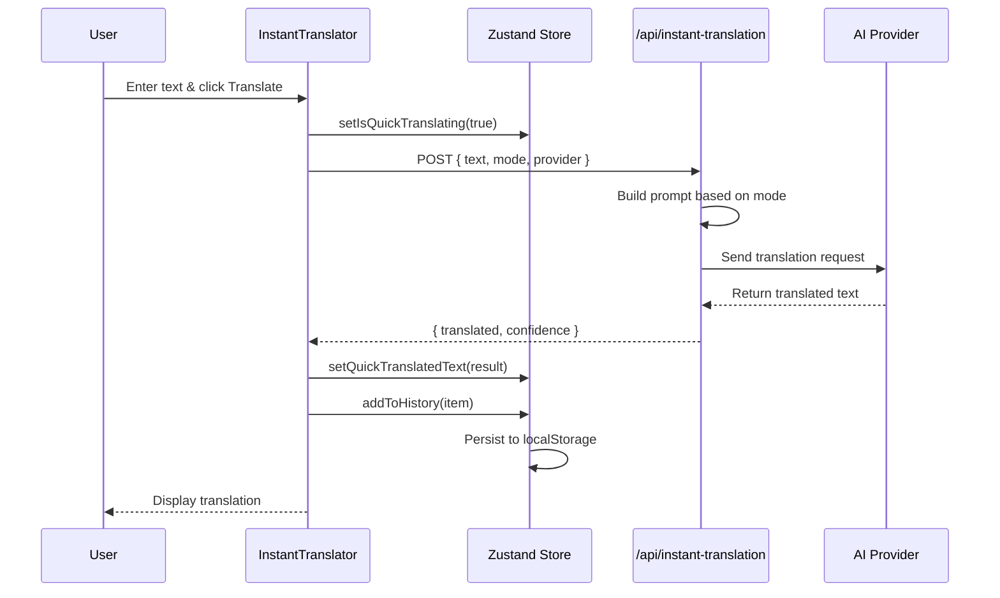
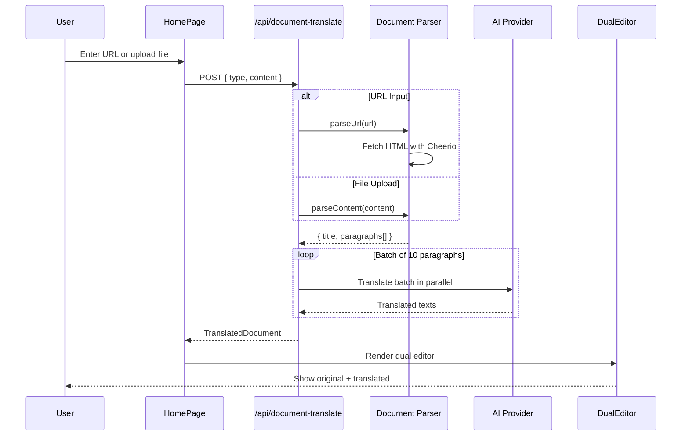
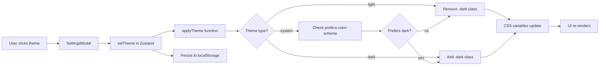
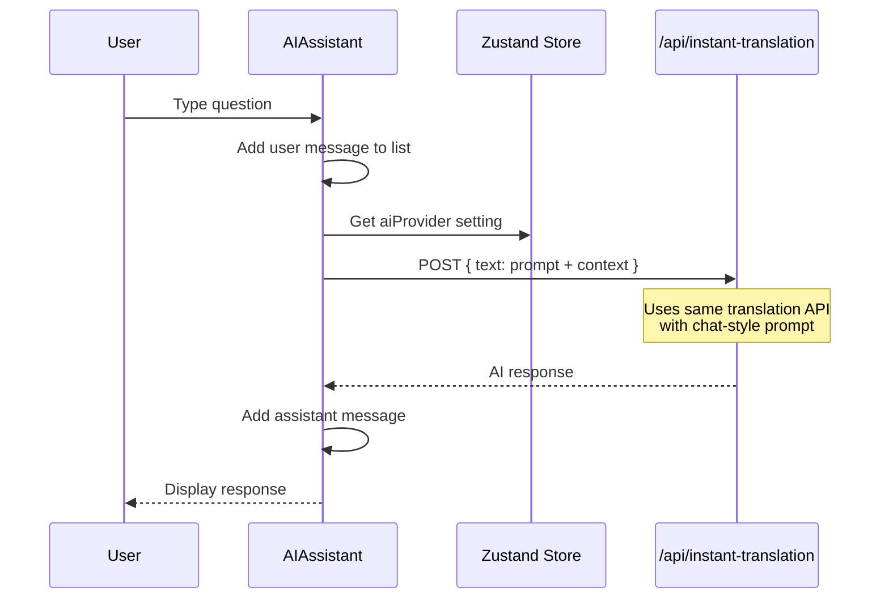
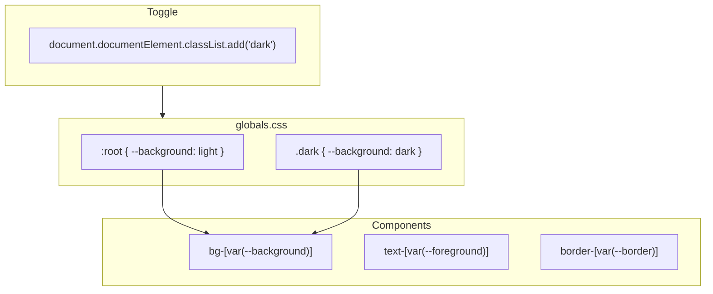
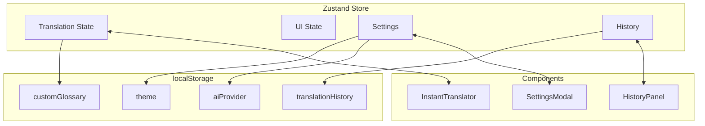
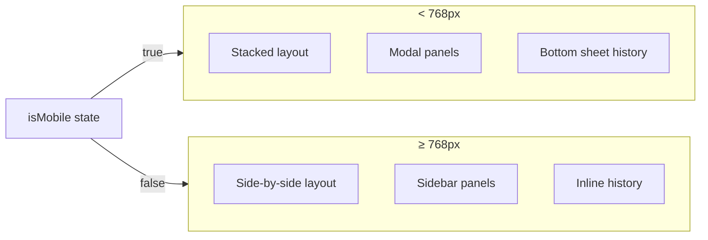

# AI Translator - Technical Overview

## 🎯 Project Summary

A cloud documentation translation platform powered by AI (Google Gemini, Claude, OpenAI). Built as a **serverless-first** application using Next.js with API routes.

---

## 🏗️ Architecture

```
┌────────────────────────────────────────────────────────┐
│                   Next.js Application                  │
│                                                        │
│   ┌─────────────┐    ┌─────────────┐    ┌───────────-┐ │
│   │  React UI   │ ←→ │   Zustand   │ ←→ │LocalStorage│ │
│   │ (Components)│    │   (State)   │    │ (Persist)  │ │
│   └─────────────┘    └─────────────┘    └───────────-┘ │
│          │                                             │
│          ▼                                             │
│   ┌─────────────────────────────────────────────────┐  │
│   │           Next.js API Routes (/api/*)           │  │
│   │  • /api/instant-translation                     │  │
│   │  • /api/document-translate                      │  │
│   │  • /api/glossary                                │  │
│   └─────────────────────────────────────────────────┘  │
└────────────────────────────────────────────────────────┘
                          │
                          ▼
         ┌────────────────────────────────────────┐
         │           AI Provider APIs             │
         │  • Google Gemini 2.5 Flash             │
         │  • Anthropic Claude 3 Sonnet           │
         │  • OpenAI GPT-4                        │
         └────────────────────────────────────────┘
```

---

## 🛠️ Tech Stack

### Frontend & API
| Category | Technology | Why We Chose It |
|----------|------------|-----------------|
| Framework | **Next.js 16** | React + API routes in one, serverless deployment |
| UI Library | **React 19** | Latest features, concurrent rendering |
| Language | **TypeScript** | Type safety, better DX |
| Styling | **Tailwind CSS 4** | Utility-first, fast development |
| State | **Zustand** | Simple, lightweight, built-in persistence |
| Icons | **Lucide React** | Consistent, tree-shakeable icons |
| Toasts | **React Hot Toast** | Simple toast notifications |
| Markdown | **React Markdown** | Render AI responses with formatting |
| HTML Parsing | **Cheerio** | Parse web pages for document translation |
| HTTP Client | **Axios** | API calls with timeout handling |
| Flags | **Flag-Icons** | Country flags for language selector |

### AI Providers
| Provider | Model | Best For |
|----------|-------|----------|
| Google Gemini | `gemini-2.5-flash` | Default - fast & cost-effective |
| Anthropic | `claude-3-sonnet` | High quality translations |
| OpenAI | `gpt-4` | Enterprise use cases |

---

## 📁 Project Structure

```
├── app/
│   ├── api/                        # Serverless API endpoints
│   │   ├── instant-translation/route.ts
│   │   ├── document-translate/route.ts
│   │   ├── glossary/route.ts
│   │   └── _lib/document-parser.ts
│   ├── globals.css                 # Theme CSS variables
│   ├── layout.tsx                  # Root layout + providers
│   └── page.tsx                    # Main app component
│
├── src/
│   ├── components/
│   │   ├── InstantTranslator.tsx   # Text translation UI
│   │   ├── HomePage.tsx            # Document upload/URL input
│   │   ├── DualEditor.tsx          # Side-by-side doc view
│   │   ├── HistoryPanel.tsx        # Translation history
│   │   ├── GlossaryPanel.tsx       # Terminology management
│   │   ├── AIAssistant.tsx         # Chat interface
│   │   └── SettingsModal.tsx       # Theme & provider settings
│   ├── store/
│   │   └── translation.ts          # Zustand state management
│   ├── api/
│   │   └── client.ts               # API wrapper
│   └── types/
│       └── index.ts                # TypeScript types
│
├── public/                         # Static assets
└── package.json
```

---

## 🔄 Application Flows

### Flow 1: Instant Translation



### Flow 2: Document Translation



### Flow 3: Theme Switching



### Flow 4: AI Assistant Chat



---

## 🎨 Theming System



**CSS Variables:**
```css
:root {
  --background: #f8fafc;
  --foreground: #0f172a;
  --surface: #ffffff;
  --muted: #64748b;
  --border: #e2e8f0;
}

.dark {
  --background: #0f172a;
  --foreground: #f1f5f9;
  --surface: #1e293b;
  --muted: #94a3b8;
  --border: #334155;
}
```

---

## 💾 State Management



**Key State Slices:**
- `quickSourceText`, `quickTranslatedText` - Current translation
- `translationMode` - professional | casual | summary
- `theme` - light | dark | system (persisted)
- `aiProvider` - gemini | claude | openai (persisted)
- `translationHistory` - Array of past translations (persisted)

---

## 📱 Responsive Design



**Component Pattern:**
```tsx
// Components accept mode prop
<GlossaryPanel mode={isMobile ? 'modal' : 'sidebar'} />
<AIAssistant mode={isMobile ? 'modal' : 'sidebar'} />
```

---

## 🔑 Environment Variables

```env
# Required - at least one AI provider
GEMINI_API_KEY=your-key      # Recommended default
CLAUDE_API_KEY=your-key      # Optional
OPENAI_API_KEY=your-key      # Optional
```

---

## 🚀 Quick Start

```bash
# Install dependencies
npm install

# Set up environment
cp .env.example .env
# Edit .env with your API keys

# Start development
npm run dev  # http://localhost:3000

# Build for production
npm run build
npm start
```

---

## 📋 Key Design Decisions

| Decision | Rationale |
|----------|-----------|
| Next.js API routes | Simpler deployment, no CORS, serverless |
| Zustand over Redux | Lighter, simpler API, built-in persistence |
| CSS variables for theming | Works with Tailwind, easy dark mode |
| Cheerio for HTML parsing | Fast, jQuery-like API, works in Node |
| Batch translation (10 parallel) | Balance speed vs rate limits |
| 30 paragraph limit | Prevent timeout on large documents |
| LocalStorage for history | No backend needed, instant access |

---

## 🔮 Potential Improvements

- [ ] Add user authentication (Supabase Auth)
- [ ] Cloud sync for history/glossary
- [ ] PDF file support
- [ ] More language pairs
- [ ] Translation memory/caching
- [ ] Streaming responses for long translations

---

*Last updated: December 2025*

